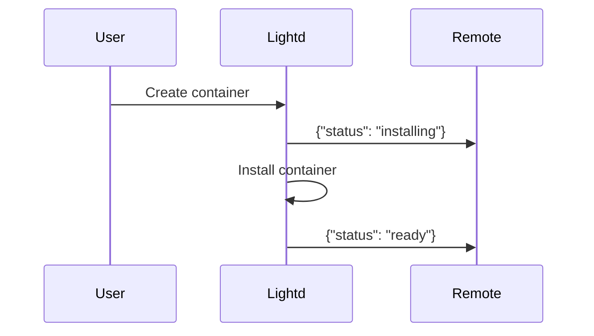

## Overview

Lightd can sync container status and events to a remote management server, enabling centralized monitoring and control across multiple Lightd instances.

## Configuration

Enable remote sync in `config.json`:

```json
{
  "remote": {
    "enabled": true,
    "url": "https://your-remote-api.com/api",
    "token": "lightd_ad2f7fc49ed640429c450e14ed07c8d5"
  }
}
```

**Fields:**
- `enabled` (boolean) - Enable/disable remote sync
- `url` (string) - Remote API base URL
- `token` (string) - Authentication token

<Warning>
Remote and Lightd must use the same token for authentication.
</Warning>

## Remote Server Requirements

Your remote server must implement these endpoints:

### Health Check

**Endpoint:** `GET /health`

**Headers:**
```http
Authorization: Bearer lightd_<token>
```

**Expected Response:**
```json
{
  "status": 200,
  "endpoint": "active"
}
```

**Purpose:** Lightd checks health every 30 seconds to verify remote is accessible.

### Receive Updates

**Endpoint:** `POST /update`

**Headers:**
```http
Authorization: Bearer lightd_<token>
Content-Type: application/json
```

**Request Body (Status Update):**
```json
{
  "event": "update",
  "server": "my-server-001",
  "status": "installing"
}
```

**Request Body (Error Update):**
```json
{
  "event": "update",
  "server": "my-server-001",
  "error": "failed",
  "data": "Docker container creation failed: image not found"
}
```

**Status Values:**
- `installing` - Container is being installed
- `ready` - Container installation complete and ready
- `failed` - Container installation or operation failed

**Expected Response:**
```json
{
  "success": true
}
```

## Event Flow

### Container Installation



<Steps>
  <Step title="User creates container">
    User creates container via Lightd API
  </Step>
  
  <Step title="Installing notification">
    Lightd → Remote: `{"event": "update", "server": "id", "status": "installing"}`
  </Step>
  
  <Step title="Container installs">
    Container installation process runs
  </Step>
  
  <Step title="Ready notification">
    Lightd → Remote: `{"event": "update", "server": "id", "status": "ready"}`
  </Step>
</Steps>

### Container Error

<Steps>
  <Step title="Installation fails">
    Container installation encounters an error
  </Step>
  
  <Step title="Error notification">
    Lightd → Remote: `{"event": "update", "server": "id", "error": "failed", "data": "error details"}`
  </Step>
</Steps>

### Container Reinstall

<Steps>
  <Step title="User triggers reinstall">
    User triggers container reinstall
  </Step>
  
  <Step title="Installing notification">
    Lightd → Remote: `{"event": "update", "server": "id", "status": "installing"}`
  </Step>
  
  <Step title="Container reinstalls">
    Container reinstallation process runs
  </Step>
  
  <Step title="Ready notification">
    Lightd → Remote: `{"event": "update", "server": "id", "status": "ready"}`
  </Step>
</Steps>

## Lifecycle Events Synced

| Lifecycle Event | Remote Status | Notes |
|----------------|---------------|-------|
| Started | `installing` | Installation started |
| CreatingContainer | `installing` | Docker container being created |
| Ready | `ready` | Container ready to start |
| Error | `failed` | Installation failed |
| ReinstallStarted | `installing` | Reinstall triggered |

## Health Check Loop

Lightd performs health checks every 30 seconds:

<Steps>
  <Step title="Send health check">
    Lightd → Remote: `GET /health`
  </Step>
  
  <Step title="Receive response">
    Remote → Lightd: `{"status": 200, "endpoint": "active"}`
  </Step>
  
  <Step title="Log result">
    If success: Log "Remote health check: OK"
    If failure: Log "Remote health check: Failed"
  </Step>
  
  <Step title="Wait and repeat">
    Wait 30 seconds and repeat
  </Step>
</Steps>

## Error Handling

**Remote Unreachable:**
- Lightd logs error but continues operating
- Updates are lost (no retry queue)
- Health check continues attempting connection

**Authentication Failure:**
- Lightd logs error
- Verify tokens match on both sides

**Timeout:**
- HTTP requests timeout after 10 seconds
- Lightd logs timeout and continues

## Local API Routes

Lightd provides routes to manage remote config:

### Get Current Config

<CodeGroup>
```bash cURL
curl -X GET http://localhost:8070/remote/config \
  -H "Authorization: Bearer lightd_token" \
  -H "Accept: Application/vnd.pkglatv1+json"
```

```javascript JavaScript
const response = await fetch('http://localhost:8070/remote/config', {
  headers: {
    'Authorization': 'Bearer lightd_token',
    'Accept': 'Application/vnd.pkglatv1+json'
  }
});

const data = await response.json();
```

```python Python
response = requests.get(
    'http://localhost:8070/remote/config',
    headers={
        'Authorization': 'Bearer lightd_token',
        'Accept': 'Application/vnd.pkglatv1+json'
    }
)

data = response.json()
```
</CodeGroup>

**Response:**
```json
{
  "version": "0.1.0",
  "server": {
    "host": "0.0.0.0",
    "port": 8070
  },
  "remote": {
    "enabled": true,
    "url": "https://remote.com/api",
    "token": "lightd_token"
  }
}
```

### Reload Config

<CodeGroup>
```bash cURL
curl -X POST http://localhost:8070/remote/config/reload \
  -H "Authorization: Bearer lightd_token" \
  -H "Accept: Application/vnd.pkglatv1+json"
```

```javascript JavaScript
await fetch('http://localhost:8070/remote/config/reload', {
  method: 'POST',
  headers: {
    'Authorization': 'Bearer lightd_token',
    'Accept': 'Application/vnd.pkglatv1+json'
  }
});
```

```python Python
requests.post(
    'http://localhost:8070/remote/config/reload',
    headers={
        'Authorization': 'Bearer lightd_token',
        'Accept': 'Application/vnd.pkglatv1+json'
    }
)
```
</CodeGroup>

**Response:**
```json
{
  "message": "Configuration reloaded successfully"
}
```

<Note>
Currently reloads from file but doesn't update running application. Restart required for changes.
</Note>

## Implementation Example

Here's a complete Express.js example for a remote server:

```javascript
const express = require('express');
const app = express();

app.use(express.json());

// Middleware to verify token
function verifyToken(req, res, next) {
  const auth = req.headers.authorization;
  if (!auth || !auth.startsWith('Bearer lightd_')) {
    return res.status(401).json({ error: 'Unauthorized' });
  }
  
  const token = auth.substring(7);
  if (token !== process.env.LIGHTD_TOKEN) {
    return res.status(401).json({ error: 'Invalid token' });
  }
  
  next();
}

// Health check
app.get('/health', verifyToken, (req, res) => {
  res.json({
    status: 200,
    endpoint: 'active'
  });
});

// Receive updates
app.post('/update', verifyToken, (req, res) => {
  const { event, server, status, error, data } = req.body;
  
  console.log(`Update from ${server}:`, { status, error, data });
  
  // Update your database
  if (status) {
    updateContainerStatus(server, status);
  }
  
  if (error) {
    logContainerError(server, error, data);
  }
  
  res.json({ success: true });
});

app.listen(3000, () => {
  console.log('Remote API listening on port 3000');
});
```

## Security Considerations

<AccordionGroup>
  <Accordion title="Use HTTPS">
    Always use HTTPS for remote URL in production to encrypt data in transit.
  </Accordion>
  
  <Accordion title="Secure tokens">
    Keep tokens secure and rotate regularly. Use environment variables or secrets managers.
  </Accordion>
  
  <Accordion title="Validate incoming data">
    Validate all incoming data on remote server to prevent injection attacks.
  </Accordion>
  
  <Accordion title="Rate limiting">
    Implement rate limiting on remote endpoints to prevent abuse.
  </Accordion>
  
  <Accordion title="Audit logging">
    Log all sync attempts for audit trail and debugging.
  </Accordion>
</AccordionGroup>

## Troubleshooting

**Remote not receiving updates:**
1. Check `remote.enabled` is `true` in config.json
2. Verify remote URL is correct
3. Ensure tokens match on both sides
4. Check remote server logs for errors
5. Verify remote `/health` endpoint returns correct response

**Health check failing:**
1. Verify remote server is running
2. Check network connectivity
3. Verify token authentication
4. Check remote server logs

**Updates delayed:**
- Updates are sent immediately (non-blocking)
- Check network latency
- Verify remote server is processing requests quickly
